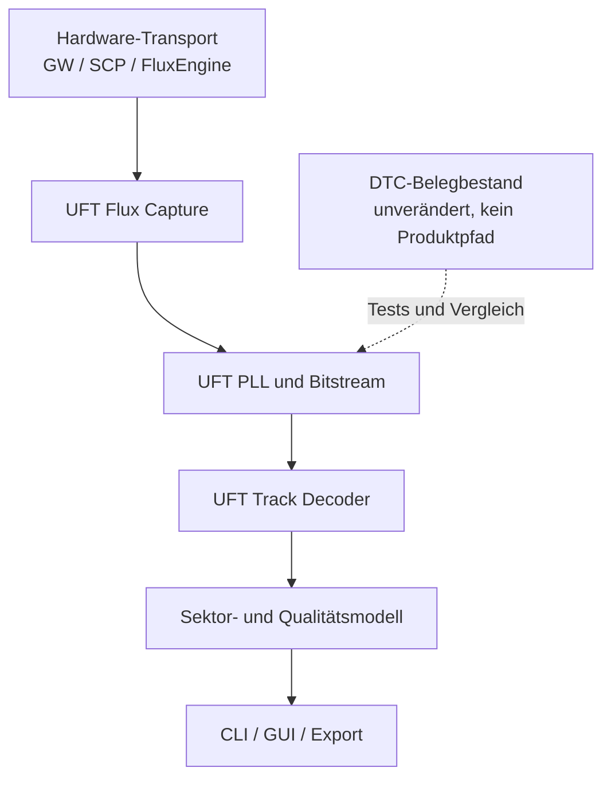

# DTC Components: Verbesserungs- und Migrationsplan

> Stand: 14. September 2026  
> Bewerteter Commit: [`7e7de7c0a93032d087af99aed731644c3ba8f9e6`](https://github.com/Axel051171/UnifiedFloppyTool/commit/7e7de7c0a93032d087af99aed731644c3ba8f9e6)  
> Bereich: [`src/dtc_components/`](https://github.com/Axel051171/UnifiedFloppyTool/tree/7e7de7c0a93032d087af99aed731644c3ba8f9e6/src/dtc_components)

## Kurzurteil

`src/dtc_components` ist ein abgegrenzter Forschungs- und Belegbestand, aber keine produktionsreife Decoderbibliothek. CRC-Grundfunktionen und Teile von FM/MFM sind als Referenz brauchbar. Trackparser, Track-Matching, GCR, Flux-Konvertierung, Schutzklassifikation, CT-Raw und IPF dürfen in der aktuellen Form nicht an einen Produktpfad angeschlossen werden.

Die vorhandenen Dateien werden **nicht verändert, verschoben, umformatiert oder automatisch repariert**. Der Audit [`scripts/audit_dtc_unveraendert.py`](https://github.com/Axel051171/UnifiedFloppyTool/blob/7e7de7c0a93032d087af99aed731644c3ba8f9e6/scripts/audit_dtc_unveraendert.py) hält den Belegbestand absichtlich bytegenau fest. Verbesserungen entstehen als neue, UFT-eigene Implementierung auf Grundlage öffentlicher Spezifikationen, eigener Tests und eigener Messungen.

Rechtliche Grundlage und Grenzen:

- [`src/dtc_components/UEBERNAHME.md`](https://github.com/Axel051171/UnifiedFloppyTool/blob/7e7de7c0a93032d087af99aed731644c3ba8f9e6/src/dtc_components/UEBERNAHME.md)
- [`src/dtc_components/SOURCE_MAP.md`](https://github.com/Axel051171/UnifiedFloppyTool/blob/7e7de7c0a93032d087af99aed731644c3ba8f9e6/src/dtc_components/SOURCE_MAP.md)
- [`docs/QUARANTINE.md`](https://github.com/Axel051171/UnifiedFloppyTool/blob/7e7de7c0a93032d087af99aed731644c3ba8f9e6/docs/QUARANTINE.md)
- [Negativabnahme `tests/test_dtc_ungeprueft.c`](https://github.com/Axel051171/UnifiedFloppyTool/blob/7e7de7c0a93032d087af99aed731644c3ba8f9e6/tests/test_dtc_ungeprueft.c)

## Zielbild

Die Transport-Umstellung bedeutet ausdrücklich **nicht**, die DTC-Dateien in einen anderen Ordner zu kopieren. Gemeint ist die kontrollierte Umstellung der Daten- und Aufrufwege:



Vorgeschlagene neue Bereiche:

```text
include/uft/flux/uft_pll.h
include/uft/analysis/uft_track_match.h
include/uft/formats/uft_track_decode.h
src/flux/uft_pll.c
src/analysis/uft_track_match.c
src/formats/uft_track_decode.c
tests/test_uft_pll.c
tests/test_uft_track_match.c
tests/test_uft_track_decode.c
tests/fuzz/fuzz_uft_flux_container.c
tests/fuzz/fuzz_uft_track_decode.c
```

Die endgültigen Pfade müssen vor dem Anlegen gegen die bereits vorhandene UFT-Struktur geprüft werden. Bestehende kanonische Implementierungen werden erweitert, nicht dupliziert.

## Prioritäten

| Priorität | Maßnahme | Abnahmekriterium |
|---|---|---|
| P0 | Belegbestand unverändert halten | DTC-Audit meldet 0 Befunde |
| P0 | DTC-Produktintegration weiterhin sperren | Kein Produktionsaufrufer, Opt-in bleibt standardmäßig AUS |
| P0 | IBM-MFM-CRC und Datenfeld neu implementieren | Gültige und beschädigte Referenzsektoren werden korrekt unterschieden |
| P0 | Leere/ungültige Eingaben überall definiert behandeln | Keine uninitialisierten Ergebnisse, kein UB, keine Abstürze |
| P1 | GCR-API symbolbasiert neu entwickeln | 4→5 und 6→8 vollständig testbar |
| P1 | Track-Matching normalisieren | Beidseitige und zirkuläre Shifts, Mindestüberlappung |
| P1 | Flux-Rundung durch PLL ersetzen | Drift-, Jitter- und Dropout-Korpus besteht |
| P1 | Detektor als Kandidatenliste ausgeben | Mehrdeutige Images erzeugen keinen erfundenen Sieger |
| P2 | Eigenes portables Flux-Containerformat | Feste Byteordnung, Limits, Version, CRC, Fuzzing |
| P2 | Schutzklassifikation zweistufig aufbauen | Erst Messbefund, dann belegte Klassifikation |
| P3 | Vorpal/V-Max erst mit Referenzkorpus | Keine öffentliche Zusage ohne reproduzierbaren Test |

## Konkrete technische Änderungen

### 1. Sichere Größen- und Bereichsprüfung

In Bitpuffern und Dateiparsern darf eine Prüfung nicht selbst überlaufen.

Schlecht:

```c
if (position + count > bit_count)
    return -1;
```

Besser:

```c
#include <stddef.h>

static int uft_range_valid(size_t position, size_t count, size_t total)
{
    return position <= total && count <= total - position;
}
```

Für Multiplikationen:

```c
#include <stdint.h>
#include <stddef.h>

static int uft_size_mul(size_t a, size_t b, size_t *out)
{
    if (out == NULL)
        return -1;
    if (a != 0 && b > SIZE_MAX / a)
        return -1;
    *out = a * b;
    return 0;
}
```

Alle öffentlichen Funktionen brauchen einen festen Vertrag:

- Welche Nullzeiger sind erlaubt?
- Ist eine leere Eingabe gültig?
- Wird das Ergebnis auch im Fehlerfall vollständig initialisiert?
- Gibt die Funktion benötigte oder tatsächlich geschriebene Größe zurück?
- Sind Quell- und Zielbereiche überlappungsfähig?
- In welcher Einheit liegen Zeiten und Positionen vor?

### 2. Bitkopie mit definierter Überlappung

Wenn Überlappung erlaubt wird, muss wie bei `memmove` in der richtigen Richtung kopiert werden:

```c
int uft_bits_move(uft_bits *dst, size_t dst_pos,
                  const uft_bits *src, size_t src_pos,
                  size_t count)
{
    if (dst == NULL || src == NULL || dst->data == NULL || src->data == NULL)
        return UFT_EINVAL;
    if (!uft_range_valid(dst_pos, count, dst->bit_count) ||
        !uft_range_valid(src_pos, count, src->bit_count))
        return UFT_ERANGE;

    if (dst == src && dst_pos > src_pos && dst_pos < src_pos + count) {
        for (size_t i = count; i-- > 0; )
            uft_bit_set(dst, dst_pos + i, uft_bit_get(src, src_pos + i));
    } else {
        for (size_t i = 0; i < count; ++i)
            uft_bit_set(dst, dst_pos + i, uft_bit_get(src, src_pos + i));
    }
    return UFT_OK;
}
```

### 3. CRC-Vertrag ehrlich machen

Die aktuelle generische CRC-Schnittstelle behauptet Breiten von 1 bis 32 Bit, der nicht reflektierte Bytepfad ist für Breiten unter 8 Bit aber nicht sicher. Es gibt zwei saubere Möglichkeiten:

1. API bewusst auf 8 bis 32 Bit beschränken.
2. Einen echten bitweisen Kern für 1 bis 32 Bit schreiben und `refin`, `refout`, `xorout` sowie Augmentierung eindeutig modellieren.

Beispiel einer klaren Beschreibung:

```c
typedef struct {
    unsigned width;       /* 8..32 in Version 1 */
    uint32_t polynomial;
    uint32_t init;
    uint32_t xor_out;
    bool reflect_input;
    bool reflect_output;
} uft_crc_spec;

int uft_crc_compute(const uft_crc_spec *spec,
                    const uint8_t *data,
                    size_t size,
                    uint32_t *result);
```

Vor einer neuen CRC-Implementierung ist zu prüfen, ob UFT denselben Algorithmus bereits kanonisch enthält. Die Normvektoren sind wichtiger als eine vierte Kopie desselben Codes.

### 4. MFM korrekt prüfen

Bei MFM ist die Datenfolge `11` zulässig. Verboten oder fehlerhaft ist eine unpassende Clock-Zelle. Eine Prüfung darf daher nicht allein benachbarte Datenbits als Verletzung zählen.

Illustrativer Decoderkern:

```c
int uft_mfm_decode_word(uint16_t encoded, uint8_t previous_data,
                        uint8_t *decoded, unsigned *violations)
{
    if (decoded == NULL || violations == NULL)
        return UFT_EINVAL;

    uint8_t value = 0;
    unsigned bad = 0;
    uint8_t prev = previous_data ? 1u : 0u;

    for (unsigned i = 0; i < 8; ++i) {
        const unsigned shift = 14u - 2u * i;
        const uint8_t clock = (encoded >> (shift + 1u)) & 1u;
        const uint8_t data  = (encoded >> shift) & 1u;
        const uint8_t expected_clock = (uint8_t)(!prev && !data);

        if (clock != expected_clock)
            ++bad;

        value = (uint8_t)((value << 1u) | data);
        prev = data;
    }

    *decoded = value;
    *violations = bad;
    return UFT_OK;
}
```

Wichtig: Der vorherige Datenbitzustand gehört zum Streamzustand. Ein Test nur mit einzelnen Bytes übersieht Fehler an Bytegrenzen.

### 5. GCR-Schnittstelle neu entwerfen

Eine Nibble-API kann 4→5-GCR abbilden, aber keine 64-Symbol-Tabelle für 6→8. Die Symbolbreite muss Teil des Vertrages sein:

```c
typedef struct {
    unsigned input_bits;     /* beispielsweise 4 oder 6 */
    unsigned code_bits;      /* beispielsweise 5 oder 8 */
    size_t symbol_count;     /* 1 << input_bits */
    const uint8_t *encode;
} uft_gcr_codebook;

int uft_gcr_encode_symbols(const uft_gcr_codebook *book,
                           const uint8_t *symbols, size_t symbol_count,
                           uint8_t *codes, size_t code_capacity,
                           size_t *codes_written);

int uft_gcr_decode_symbols(const uft_gcr_codebook *book,
                           const uint8_t *codes, size_t code_count,
                           uint8_t *symbols, size_t symbol_capacity,
                           size_t *symbols_written,
                           size_t *invalid_codes);
```

Apple 6-and-2 ist mehr als eine Tabelle. Die Aufteilung, Rückverteilung und Prüfsumme gehören in einen eigenen formatspezifischen Codec mit bekannten Sektorvektoren.

### 6. IBM-MFM-Trackparser vollständig machen

Die CRC eines IBM-ID-Feldes beginnt am ersten `A1`:

```c
/* decoded points at A1 A1 A1 FE C H R N CRC1 CRC2 */
const uint16_t residue = uft_crc16_ccitt(decoded, 10, 0xffffu);
const bool header_ok = residue == 0;
```

Ein vollständiger Parser muss danach das passende Datenfeld suchen:

- `A1 A1 A1 FB` für normale Daten;
- `A1 A1 A1 F8` für deleted data;
- Datenlänge aus `N` mit geprüfter Obergrenze;
- CRC über Syncbytes, Datenmarke und Nutzdaten;
- Duplikate, fehlende Felder und Track-Wrap;
- getrennte Zustände für „nicht vorhanden“, „vorhanden aber CRC-falsch“ und „vollständig gültig“.

Vorgeschlagenes Ergebnis:

```c
typedef enum {
    UFT_SECTOR_NO_DATA,
    UFT_SECTOR_DATA_BAD_CRC,
    UFT_SECTOR_DATA_OK
} uft_sector_data_state;

typedef struct {
    uint8_t cylinder, head, sector, size_code;
    bool id_crc_ok;
    bool deleted_data;
    uft_sector_data_state data_state;
    size_t data_offset_bits;
    size_t data_length;
    uint16_t stored_id_crc;
    uint16_t stored_data_crc;
} uft_ibm_sector;
```

### 7. Track-Matching nach Fehlerrate

Absolute Fehlerzahlen bevorzugen kurze Überlappungen. Verglichen wird deshalb die Fehlerrate bei fester Mindestüberlappung.

```c
typedef struct {
    ptrdiff_t shift;
    size_t compared_bits;
    size_t differing_bits;
    double similarity;
    bool ambiguous;
} uft_track_match_result;

static double uft_similarity(size_t different, size_t compared)
{
    return compared == 0
        ? 0.0
        : 1.0 - (double)different / (double)compared;
}
```

Regeln:

- leere Eingabe ergibt `UFT_ENODATA`;
- Ergebnisstruktur wird vor jeder Rückgabe vollständig initialisiert;
- positive und negative Shifts;
- bei vollständigen Tracks zirkuläre Verschiebung;
- Mindestüberlappung, beispielsweise 85 Prozent;
- Auswahl nach höchster Ähnlichkeit;
- Gleichstand: größere Überlappung, danach kleinerer absoluter Shift;
- schneller Kern über XOR und Popcount;
- optional grobe Suche und anschließende Feinsuche.

### 8. Weak-Bit-Erkennung liefert Regionen

Einzelne Positionen sind keine Regionen. Zuerst werden mehrere Revolutionen ausgerichtet, danach werden zusammenhängende Bereiche mit hoher Uneinigkeit gebildet:

```c
typedef struct {
    size_t start_bit;
    size_t end_bit;              /* exklusiv */
    double disagreement_ratio;
    double confidence;
    unsigned contributing_passes;
} uft_weak_region;
```

Eine Region ist erst dann ein Schutzsignal, wenn Jitter, Dropouts, unterschiedliche Revolutionlängen und normale Lesefehler als alternative Ursache bewertet wurden.

### 9. Flux-Konvertierung durch PLL ersetzen

`round(flux_time / nominal_cell)` ist ein Quantisierer, keine PLL. Die neue Stufe muss mindestens besitzen:

- Phasenfehler und laufende Frequenzkorrektur;
- erlaubten Zellzeitbereich;
- Lock-/Unlock-Zustand;
- Behandlung von Dropouts und Ausreißern;
- Index- und Revolutionsgrenzen;
- Qualitätsstatistik pro Track.

API-Skizze:

```c
typedef struct {
    double nominal_cell_ns;
    double min_cell_ns;
    double max_cell_ns;
    double phase_gain;
    double frequency_gain;
} uft_pll_config;

typedef struct {
    double estimated_cell_ns;
    double rms_phase_error;
    size_t transitions;
    size_t outliers;
    size_t dropouts;
    bool locked;
} uft_pll_report;
```

Alle Fließkommaeingaben müssen mit `isfinite()` geprüft werden. Für Varianz und RMS ist ein stabiles Online-Verfahren wie Welford sinnvoll.

### 10. Formaterkennung ohne erfundenen Sieger

Dateiendung und Größe sind Hinweise, keine Beweise. Das Ergebnis sollte mehrere Kandidaten mit Gründen liefern:

```c
typedef enum {
    UFT_EVIDENCE_EXTENSION = 1u << 0,
    UFT_EVIDENCE_MAGIC     = 1u << 1,
    UFT_EVIDENCE_SIZE      = 1u << 2,
    UFT_EVIDENCE_STRUCTURE = 1u << 3,
    UFT_EVIDENCE_CHECKSUM  = 1u << 4
} uft_detection_evidence;

typedef struct {
    uft_format_id format;
    unsigned confidence;          /* 0..100 */
    unsigned evidence;
} uft_format_candidate;
```

Eine beliebige `.raw`-Datei darf nicht automatisch als KryoFlux gelten. Bei gleicher Bildgröße von ADF/IMG/Rohformaten bleibt das Ergebnis mehrdeutig, bis interne Strukturen geprüft wurden.

### 11. Portables Flux-Containerformat

Die aktuelle native Strukturausgabe in `ctraw.c` ist von Padding und Host-Byteordnung abhängig. Eine neue UFT-Datei wird Feld für Feld serialisiert.

Beispielheader, nur als Entwurfsrichtung:

```c
/* On-disk fields, always little-endian; never fwrite this struct directly. */
typedef struct {
    uint8_t magic[8];          /* "UFTFLUX\0" */
    uint16_t version;
    uint16_t header_size;
    uint32_t flags;
    uint32_t track_count;
    uint64_t directory_offset;
    uint64_t file_size;
    uint32_t header_crc32;
} uft_flux_header;
```

Pflicht:

- feste Byteordnung;
- Versions- und Headergrößenprüfung;
- Gesamtdateilänge;
- harte Limits;
- geprüfte Offsets, Additionen und Multiplikationen;
- Trackverzeichnis;
- CRC pro Header und Track;
- unbekannte optionale Chunks überspringbar;
- Kompression als separat versionierter Codec;
- Roundtrip-, Golden-File- und Fuzztests.

Der Name „CT Raw“ wird nur verwendet, wenn echte und rechtlich belastbare Kompatibilität nachgewiesen ist. Sonst bekommt das Format einen neutralen UFT-Namen.

### 12. Schutzanalyse zweistufig halten

Die Messstufe liefert objektive Befunde:

- ungewöhnliche Tracklänge;
- illegale Clockmuster;
- instabile Zellzeiten;
- Unterschiede zwischen Revolutionen;
- ungewöhnliche Sync- oder Sektoranordnung.

Erst eine zweite Stufe ordnet einen bekannten Schutz zu. `VORPAL` oder `VMAX` darf nur ausgegeben werden, wenn mehrere unabhängige Merkmale und ein benannter Referenzkorpus die Zuordnung tragen. Ein Enum-Wert allein ist keine Implementierung.

## Testplan

### Deterministische Unit- und Property-Tests

- CRC: Katalogvektor `123456789`, Restwerttests und leere Eingabe.
- FM/MFM: alle 256 Einzelbytes, anschließend alle relevanten vorherigen Datenbitzustände.
- MFM: beschädigte Clockzellen und gültige benachbarte Daten-Einsen.
- GCR: jedes gültige Symbol, jedes ungültige Codewort, Kapazitätsgrenzen.
- Bitbuffer: Nullzeiger, Null-Längen, Überlappung und `SIZE_MAX`-Grenzen.
- Trackparser: IDAM, DAM, deleted DAM, CRC-Fehler, Duplikate, Track-Wrap.
- Matching: beide Shiftrichtungen, zirkuläre Lage, Mindestüberlappung und Gleichstand.
- Weak-Bit: ausgerichtete und absichtlich verschobene Revolutionen.
- PLL: Drift, Jitter, Dropout, Ausreißer und Drehzahlschwankung.
- Container: Roundtrip, abgeschnittene Dateien, übergroße Werte und defekte CRCs.

### Compiler und dynamische Prüfungen

- GCC und Clang;
- `-Wall -Wextra -Wpedantic -Wconversion -Wshadow`;
- AddressSanitizer;
- UndefinedBehaviorSanitizer;
- optional MemorySanitizer mit Clang;
- Fuzzer für Dateiformate und längengesteuerte Parser.

## Transport-Umstellung

### Regeln

1. `src/dtc_components/**` bleibt bytegenau unverändert.
2. Kein Produktionsmodul inkludiert `dtc_components.h`.
3. Neue Implementierung benutzt UFT-Namen und UFT-Datentypen.
4. Hardwaretransporte liefern ein gemeinsames Flux-Capture-Modell.
5. PLL, Decoder und Analyse hängen nicht direkt von Greaseweazle, SCP oder FluxEngine ab.
6. Alt- und Neupfad dürfen während der Messphase parallel testbar sein, aber nur der bestehende freigegebene UFT-Pfad bleibt produktiv.
7. Umschaltung erfolgt erst nach Tests, Korpusvergleich und dokumentierter Abnahme.
8. Ein Feature-Flag ist kein Ersatz für Korrektheit.

### Adaptergrenze

```c
typedef struct {
    const uint32_t *interval_ticks;
    size_t interval_count;
    double tick_ns;
    uint32_t cylinder;
    uint32_t head;
    uint32_t revolution;
} uft_flux_capture;

typedef struct {
    int (*capture_track)(void *context,
                         unsigned cylinder,
                         unsigned head,
                         uft_flux_capture *capture);
    void (*release_capture)(void *context, uft_flux_capture *capture);
} uft_flux_transport;
```

Greaseweazle, SCP und FluxEngine implementieren nur diesen Transportvertrag. Die nachgelagerte Auswertung arbeitet ausschließlich mit `uft_flux_capture`. Damit wird Hardware-I/O von Algorithmen getrennt und ein Capture kann ohne angeschlossene Hardware reproduzierbar getestet werden.

### Umschaltfolge

1. Bestehende Transportausgaben dokumentieren und als Fixtures sichern.
2. Gemeinsames `uft_flux_capture`-Modell ergänzen.
3. Einen Transportadapter nach dem anderen anschließen.
4. Für jeden Adapter Byte-/Tick-Gleichheit gegen den bisherigen Pfad prüfen.
5. Neue PLL hinter interner Testoption parallel rechnen lassen.
6. Berichte vergleichen, aber Produktentscheidung noch aus dem alten Pfad nehmen.
7. Abweichungen klassifizieren: alter Fehler, neuer Fehler, Rundungsunterschied oder echte Mehrdeutigkeit.
8. Erst nach bestandenem Korpus den neuen Pfad zum Standard machen.
9. Alten Adapter nach einer Übergangsrelease entfernen; Fixtures und Regressionstests bleiben.

## Vollständiger Kommandosatz für ein KI-Terminal

Die Befehle arbeiten auf einem eigenen Branch. Sie verändern den DTC-Belegbestand nicht. Der Agent muss vor jedem Commit `git diff -- src/dtc_components` prüfen.

### Linux, macOS, WSL oder Git Bash

```bash
git clone https://github.com/Axel051171/UnifiedFloppyTool.git
cd UnifiedFloppyTool

git fetch --all --prune
git switch main
git pull --ff-only
git status --short
git rev-parse HEAD

python3 scripts/audit_dtc_unveraendert.py
python3 scripts/audit_dtc_unveraendert.py --selbsttest

git switch -c refactor/uft-flux-decoder-cleanroom

# Erst Struktur und vorhandene Implementierungen prüfen.
find . -name AGENTS.md -o -name CLAUDE.md -print
rg -n "UFT_WITH_DTC_COMPONENTS|dtc_components|flux_crc16|mfm|gcr|track_match|weak|PLL|capture_track" \
  CMakeLists.txt UnifiedFloppyTool.pro include src tests .github

# Keine Dateien aus src/dtc_components kopieren.
# Zielpfade erst nach der Bestandsprüfung anlegen.
mkdir -p include/uft/analysis include/uft/flux include/uft/formats
mkdir -p src/analysis src/flux src/formats tests/fuzz tests/fixtures/flux

# Der Agent erzeugt/ändert die Dateien mit seinem Patch-Werkzeug.
# Danach zuerst die Schutzgrenze prüfen.
git diff -- src/dtc_components
python3 scripts/audit_dtc_unveraendert.py

# Buildsystem-Parität und Konsistenz nach Repository-Regeln prüfen.
python3 scripts/verify_build_sources.py
python3 scripts/check_consistency.py

# Normaler Test-Build. Qt6 und die Projektabhängigkeiten müssen installiert sein.
cmake -S . -B build-dtc-clean \
  -DCMAKE_BUILD_TYPE=Debug \
  -DUFT_BUILD_APP=OFF
cmake --build build-dtc-clean --parallel
ctest --test-dir build-dtc-clean --output-on-failure

# ASan + UBSan. Das Projekt besitzt dafür UFT_SANITIZE.
cmake -S . -B build-dtc-asan \
  -DCMAKE_BUILD_TYPE=Debug \
  -DUFT_BUILD_APP=OFF \
  -DUFT_SANITIZE=address,undefined
cmake --build build-dtc-asan --parallel
ASAN_OPTIONS=detect_leaks=1:halt_on_error=1 \
UBSAN_OPTIONS=halt_on_error=1:print_stacktrace=1 \
ctest --test-dir build-dtc-asan --output-on-failure

# Optional: eigenständigen Belegbestand weiterhin bauen und testen,
# sofern dessen CMake-Schnittstelle unverändert verfügbar ist.
cmake -S src/dtc_components -B build-dtc-evidence \
  -DCMAKE_BUILD_TYPE=Debug
cmake --build build-dtc-evidence --parallel
ctest --test-dir build-dtc-evidence --output-on-failure

# Änderungen prüfen.
git status --short
git diff --check
git diff --stat
git diff -- src/dtc_components
python3 scripts/audit_dtc_unveraendert.py
python3 scripts/check_consistency.py

# Nur nach vollständig grünen Prüfungen committen.
git add -- \
  include/uft \
  src/analysis src/flux src/formats \
  tests CMakeLists.txt UnifiedFloppyTool.pro docs

git diff --cached -- src/dtc_components
git diff --cached --check
git status --short

git commit -m "refactor(flux): add clean UFT decoding pipeline"
git show --stat --oneline HEAD
git push -u origin refactor/uft-flux-decoder-cleanroom
```

Hinweis: `scripts/verify_build_sources.py` kann je nach aktuellem Stand weitere Pflichtargumente verlangen. Der Agent liest in diesem Fall zuerst `--help` und die Datei; er rät keine Parameter.

### Windows PowerShell

```powershell
git clone https://github.com/Axel051171/UnifiedFloppyTool.git
Set-Location UnifiedFloppyTool

git fetch --all --prune
git switch main
git pull --ff-only
git status --short
git rev-parse HEAD

py -3 scripts/audit_dtc_unveraendert.py
py -3 scripts/audit_dtc_unveraendert.py --selbsttest

git switch -c refactor/uft-flux-decoder-cleanroom

Get-ChildItem -Recurse -File -Include AGENTS.md,CLAUDE.md
rg -n "UFT_WITH_DTC_COMPONENTS|dtc_components|flux_crc16|mfm|gcr|track_match|weak|PLL|capture_track" CMakeLists.txt UnifiedFloppyTool.pro include src tests .github

New-Item -ItemType Directory -Force include/uft/analysis,include/uft/flux,include/uft/formats
New-Item -ItemType Directory -Force src/analysis,src/flux,src/formats,tests/fuzz,tests/fixtures/flux

git diff -- src/dtc_components
py -3 scripts/audit_dtc_unveraendert.py
py -3 scripts/verify_build_sources.py
py -3 scripts/check_consistency.py

cmake -S . -B build-dtc-clean -DCMAKE_BUILD_TYPE=Debug -DUFT_BUILD_APP=OFF
cmake --build build-dtc-clean --parallel
ctest --test-dir build-dtc-clean --output-on-failure

git status --short
git diff --check
git diff --stat
git diff -- src/dtc_components
py -3 scripts/audit_dtc_unveraendert.py
py -3 scripts/check_consistency.py

git add -- include/uft src/analysis src/flux src/formats tests CMakeLists.txt UnifiedFloppyTool.pro docs
git diff --cached -- src/dtc_components
git diff --cached --check
git status --short

git commit -m "refactor(flux): add clean UFT decoding pipeline"
git push -u origin refactor/uft-flux-decoder-cleanroom
```

Sanitizer-Ausführung erfolgt vorzugsweise unter Linux/WSL oder in der bestehenden Linux-CI. MinGW stellt die benötigten Sanitizer nicht in jeder Installation zuverlässig bereit.

## Agenten-Prompt

Der folgende Prompt kann unverändert an Codex, Claude Code oder einen vergleichbaren Terminal-Agenten übergeben werden:

```text
Du arbeitest im Repository:
https://github.com/Axel051171/UnifiedFloppyTool

Ziel:
Entwickle eine neue, eigenständige und testbare UFT-Pipeline für Flux-Capture,
PLL/Bitstream, Track-Decoding und Track-Analyse. Die vorhandenen Dateien unter
src/dtc_components sind ein unveränderlicher Belegbestand und dürfen nicht
bearbeitet, verschoben, umformatiert, neu lizenziert oder in Produktionscode
kopiert werden.

Verbindliche Regeln:
1. Lies zuerst alle AGENTS.md- und CLAUDE.md-Dateien, die für geänderte Pfade gelten.
2. Prüfe den aktuellen Branch, Arbeitsbaum, Buildsysteme und CI-Workflows.
3. Führe vor der ersten Änderung aus:
   python3 scripts/audit_dtc_unveraendert.py
   python3 scripts/audit_dtc_unveraendert.py --selbsttest
4. Ändere niemals src/dtc_components/**.
5. Verwende daraus keine nicht normbestimmten Implementierungsdetails.
6. Neue Algorithmen müssen aus öffentlichen Spezifikationen, bereits
   kanonischem UFT-Code, eigenen Tests und eigenen Messungen entstehen.
7. Prüfe vor jeder neuen Datei, ob UFT dieselbe Funktion bereits besitzt.
   Erweitere die kanonische Implementierung statt Duplikate zu erzeugen.
8. qmake/UnifiedFloppyTool.pro ist für den Produktionsbuild maßgeblich;
   CMake muss für Tests und CI konsistent bleiben.
9. Kein Feature-Flag darf defekten oder ungeprüften Code legitimieren.
10. Keine erfundenen Formaterkennungen oder Schutzklassifikationen.
11. Ergebnisse und Fehlerstrukturen werden auf jedem Rückweg vollständig
    initialisiert.
12. Größen, Additionen, Multiplikationen, Offsets und Kapazitäten werden
    vor Benutzung überlaufsicher geprüft.
13. Keine destruktiven Git-Befehle. Keine fremden Änderungen verwerfen.
14. Kleine, logisch getrennte Commits. Noch nichts nach main mergen.

Arbeitsfolge:
A. Bestandsaufnahme
- Suche nach bestehenden CRC-, FM/MFM-, GCR-, PLL-, Flux-, Sektor-, IPF-,
  Matching-, Weak-Bit- und Schutzimplementierungen.
- Dokumentiere, welche Implementierung kanonisch ist und welche nur Skelett,
  Testhilfe, Quarantäne oder unbenutzter Code ist.
- Ermittle alle Produktionsaufrufer und Buildregistrierungen.
- Lege noch keinen neuen Code an, bevor diese Karte fertig ist.

B. Verträge und Tests
- Definiere UFT-eigene APIs für Flux-Capture, PLL-Bericht, IBM-Sektorbefund,
  Track-Match und Weak-Regionen.
- Schreibe zuerst fehlschlagende Tests für:
  * IBM-MFM-CRC ab A1 A1 A1;
  * vollständiges DAM/F8-Datenfeld und Daten-CRC;
  * leere und ungültige Eingaben;
  * positive, negative und zirkuläre Trackverschiebungen;
  * Mindestüberlappung und normalisierte Fehlerrate;
  * MFM-Zustand an Bytegrenzen;
  * GCR 4→5 und 6→8 mit ungültigen Codes;
  * PLL mit Drift, Jitter, Dropouts und Ausreißern;
  * abgeschnittene und bösartige Containerdaten.
- Nutze keine assert()-Only-Testlogik, die unter NDEBUG verschwindet, ohne
  dass das Repository die Schärfe ausdrücklich misst.

C. Transport-Umstellung
- Führe ein gemeinsames uft_flux_capture-Modell ein.
- Hardwareadapter für Greaseweazle, SCP und FluxEngine liefern nur dieses Modell.
- PLL, Decoder und Analyse enthalten keine hardwareabhängigen Includes.
- Sichere vorhandene Transportausgaben als reproduzierbare Fixtures.
- Stelle einen Adapter nach dem anderen um.
- Vergleiche alte und neue Ausgaben, bevor der neue Weg Standard wird.
- Der bestehende freigegebene Produktpfad bleibt aktiv, bis der neue Korpus
  vollständig besteht.

D. Algorithmen
- CRC: vorhandene UFT-Routinen gegen Normvektoren verwenden; nicht duplizieren.
- MFM: Clockregel mit vorherigem Datenbit prüfen; benachbarte Daten-Einsen sind
  nicht automatisch illegal.
- GCR: symbolbasierte API; Apple 6-and-2 als eigener formatspezifischer Schritt.
- Trackparser: IDAM, DAM/F8, variable Länge, beide CRCs, Duplikate und Wrap.
- Matching: signierter Shift, circular mode, Mindestüberlappung, XOR+Popcount.
- Weak-Bit: Revolutionen zuerst ausrichten; zusammenhängende Regionen mit
  Konfidenz liefern.
- PLL: Phase und Zellzeit nachführen; Lock, Residualfehler, Dropouts und
  Ausreißer berichten.
- Detektion: Kandidaten plus Evidenz und Konfidenz; bei Mehrdeutigkeit keinen
  Sieger erfinden.
- Schutz: erst objektive Signale, dann belegte Klassifikation.
- IPF: vorhandenen stärkeren UFT-T1-Pfad verwenden; keinen zweiten Parser bauen.
- CT-Raw: nicht implementieren, solange die dokumentierte Stufe 3 gesperrt ist.
  Falls ein neues UFT-Fluxformat benötigt wird, neutral benennen und von Grund
  auf portabel, versioniert, begrenzt, geprüft und fuzzbar entwerfen.

E. Verifikation
Nach jedem logisch abgeschlossenen Paket:
- git diff -- src/dtc_components
- python3 scripts/audit_dtc_unveraendert.py
- python3 scripts/check_consistency.py
- git diff --check
- Debug-Build und vollständiges CTest
- ASan+UBSan-Build unter Linux/WSL
- relevante Fuzz-Smoke-Tests
- Buildsystem-Parität zwischen qmake und CMake

Abbruchbedingungen:
- Der DTC-Audit meldet einen Befund.
- Eine erforderliche öffentliche Spezifikation oder Referenz fehlt.
- Die Lizenz-/Quarantänegrenze würde überschritten.
- Ein Test lässt sich nur durch Abschwächen oder Entfernen bestehender Gates
  grün bekommen.
- Ein vorhandener Benutzer-Change überschneidet sich unauflösbar mit der Arbeit.
- Ein externer Push, PR oder Merge wäre nötig, ist aber nicht ausdrücklich
  beauftragt.

Bericht nach jedem Paket:
1. Ergebnis in einem Satz.
2. Geänderte Dateien.
3. Behobener Fehler und reproduzierender Test.
4. Ausgeführte Befehle mit Exitstatus.
5. Offene Risiken und nicht getestete Plattformen.
6. Bestätigung: src/dtc_components unverändert, Audit 0 Befunde.
7. Nächster kleinster sinnvoller Schritt.

Beginne jetzt ausschließlich mit Phase A, der Bestandsaufnahme. Präsentiere
danach den konkreten Änderungsplan und warte vor der ersten produktiven
Transport-Umstellung auf Freigabe. Kleine Testergänzungen, die nur bestehendes
Verhalten messen und keine Produktpfade ändern, dürfen vorbereitet werden.
```

## Definition of Done

Die Umstellung ist erst fertig, wenn alle folgenden Punkte erfüllt sind:

- DTC-Audit dauerhaft grün;
- kein Produktaufrufer von `dtc_components.h`;
- neue APIs dokumentiert und kapazitätssicher;
- Norm- und Golden-File-Tests reproduzierbar;
- reale Capture-Fixtures für alle unterstützten Transporte;
- GCC-, Clang-, ASan- und UBSan-Läufe grün;
- Parser-Fuzzing ohne reproduzierbaren Crash;
- qmake- und CMake-Quellenlisten konsistent;
- mehrdeutige Erkennung bleibt ausdrücklich mehrdeutig;
- Schutzbezeichnungen besitzen einen benannten Referenzkorpus;
- Migrationsbericht nennt bekannte Abweichungen;
- erst danach Aktivierung im Produktpfad.

## Nicht tun

- DTC-Dateien „nur kurz“ reparieren.
- Den Hash-Audit aktualisieren, um Änderungen am Belegbestand passend zu machen.
- Native C-Strukturen direkt als Dateiformat schreiben.
- `.raw` allein anhand der Endung klassifizieren.
- Apple 6-and-2 durch eine 16-Nibble-Schleife ersetzen.
- Ähnlichkeit anhand absoluter Fehler bei unterschiedlicher Überlappung wählen.
- `VORPAL`, `VMAX` oder `WEAK_BITS` ausgeben, weil der Enum-Wert existiert.
- Ungeprüften Code über einen GUI-Schalter produktiv erreichbar machen.
- Bestehende UFT-Implementierungen duplizieren.
- Tests abschwächen, überspringen oder aus CI herausdefinieren, damit der Branch grün wird.
